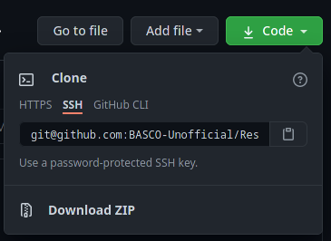

### GitHub SSH Authentication

#### [Home](README.md)

Here are the steps for connecting with GitHub over SSH. Read the rest of the article for background on why.

[Go directly to the steps!](#SSH-Authentication)
---

Interaction with GitHub using git over HTTPS was an adequate solution for confidentiality and authorization. However, being required to enter account credentials each time I needed to perform network actions became cumbersome when a strong password has been implemented.

In my case, I required a "unified" authentication scheme; one I had used for authentication in other systems, but had high entropy and was fully encrypted. Accordingly, workflow integration with `git` needed to be trivial.

### Caching Credentials
Among the first solutions found was a feature built into git which [caches user credentials](https://docs.github.com/en/free-pro-team@latest/github/using-git/caching-your-github-credentials-in-git#platform-linux).
```
	git config --global credential.help cache
```
However, this solution continued to prompt for credentials every 15 minutes, by default. While the timeout is able to be changed, I did not find this solution addressed *my* requirements. Therefore, I kept on with my search.
```
	#timeout in units of seconds (3600s = 1hr)
	git config --global credential.helper 'cache --timeout=3600'
```
### Storing Credentials Locally
One of the simplest options I have found regarding this issue was to hard-code the user credentials into the [*.netrc* file](https://linux.die.net/man/5/netrc). Implementation of this method simply involved adding a 3-line entry to the file:
```
		machine github.com
		login <github username>
		password <github password>
```

While being extremely easy to implement, **this solution was markedly unsafe** -- the account credentials are stored in **plaintext**. In my attempt to keep these details safe, I found a solution to encrypt the file using a GPG key file. See my walk through on creating and using a GPG keyfile for more information.

While a viable solution, inspection of the setup process revealed this method [involved a lot of moving parts](http://stackoverflow.com/a/18362082/6309). By virtue of complexity, I deduced that errors were imminent if I did not regularly maintain this implementation. Since I knew I would not be using `git` on a daily basis, I determined that this was not a solution I was willing to attempt.

After a few hours of reading through documentation and forum posts, I believed to have found the solution I yearned for. This method involved using the SSH protocol, rather than HTTPS. Since I regularly use `ssh` in other workflows, the infrastructure was already in place. Consequently, maintaining the keys required much less forethought.

### SSH Authentication

If I did not already have an SSH key, I would have created one with
```
	ssh-keygen -o -a 100 -t ed25519
```
which placed an OpenSSH private key in my `.ssh` directory derived from 100 rounds of the Ed25519 algorithm. The Ed25519 algorithm is smaller, faster, and equally safe as an RSA key of 4096-bits. While, Ed25519 is not supported by legacy systems, use of this key with GitHub was not an issue. **For best security practices, a [strong passphrase](https://xkcd.com/936/) should be entered at creation time.** The passphrase should be stored securely in a digital vault; even better if both strong and memorable.

I enabled SSH authentication with GitHub simply by copying the matching public key to my [profile](https://github.com/settings/keys).

Next, the destination needed to be changed for each repository to use SSH.
1. While in a directory containing a `.git` folder, confirm the remote URL is HTTPS:
```
	git remote -v
```


2. Change remote URL:
```
	git remote set-url origin git@github.com:<username>/<repo>.git
```
If the URL entered was invalid, and the returned error will be
```
	git remote set-url sofake https://github.com/octocat/Spoon-Knife
		fatal: No such remote 'sofake'
```

3. Verify remote URL:
```
	git remote -v
```


Finally, cloning further GitHub repositories do not need to be converted each time; the SSH URL is made available by GitHub when the 'SSH' tab is selected, seen below. Simply add this URL to the command
```
	git clone <URL>
```



### Conclusion

Authenticating my GitHub account credentials each time I needed to `push`, `pull` , or `fetch` became a chore. Since the password was complex and not easily memorable, I needed to retrieve it from my password vault. This added extra unnecessary steps. In a search for solutions to this problem, I found credential caching, hard-coded credentials, and SSH authentication.

Credential caching still required I fetch my GitHub password from the vault, albeit not as frequently. Hard-coded credentials was a simple solution, but left my password as plain text. Encrypting the file was complex and added points of failure in the authentication scheme. SSH authentication featured a compromise in complexity and convenience whilst offering optimal security.

Since I regularly use `ssh` in other workflows, implementation was straightforward an required very little forethought to maintain keys. By using the SSH protocol, I can now use a highly-memorable, highly-secure, and convenient passphrase to authenticate GitHub network actions.
